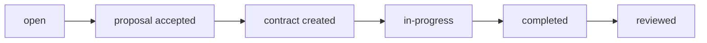

# Craftworks Backend API Documentation

## Authentication

- Register: `POST /api/auth/register`
- Login: `POST /api/auth/login`
- Forgot Password: `POST /api/auth/forgot-password`
  - **Example Request:**
    ```json
    { "email": "john@example.com" }
    ```
  - **Example Response (for testing):**
    ```json
    { "message": "Password reset token generated", "token": "..." }
    ```
  - *Note: Token is hashed in DB, expires in 15 minutes, and is single-use. In production, it is emailed to the user.*
- Reset Password: `POST /api/auth/reset-password`
  - **Example Request:**
    ```json
    { "token": "...", "password": "newpassword123" }
    ```
  - **Example Response:**
    ```json
    { "message": "Password has been reset" }
    ```
- All protected endpoints require a Bearer JWT token in the `Authorization` header.

## User Roles
- `admin`: Can manage users, jobs, services, reports, etc.
- `moderator`: Can moderate content and manage reports.
- `client`: Can post jobs, review craftsmen, message, etc.
- `craftsman`: Can submit proposals, manage profile, message, etc.

## User Ratings
- Every user (client or craftsman) has a `rating` (average, 1-5) and `rating_count` (number of received reviews) field on their user profile.
- Ratings are updated automatically whenever a review is created or updated.
- Both clients and craftsmen can review each other after a job is completed, but only after the contract is marked as completed and only once per contract.
- Example user object:
  ```json
  {
    "_id": "...",
    "role": "craftsman",
    "full_name": "Jane Smith",
    "email": "jane@example.com",
    "rating": 4.8,
    "rating_count": 12,
    ...
  }
  ```

## Pagination
- All paginated endpoints return:
  ```json
  {
    "data": [ ... ],
    "pagination": {
      "page": 1,
      "limit": 10,
      "totalPages": 5,
      "totalItems": 42
    }
  }
  ```

## HTTP Status Codes
- `200 OK`: Successful GET, PUT, DELETE
- `201 Created`: Successful POST
- `400 Bad Request`: Invalid input
- `401 Unauthorized`: Not logged in or invalid token
- `403 Forbidden`: Not allowed
- `404 Not Found`: Resource does not exist
- `500 Server Error`: Unexpected error

## Main Endpoints & Examples

### Users
- `GET /api/users/me` — Get your profile (any authenticated user)
- `GET /api/users/:id` — Get public user profile (email/phone only if self or admin/moderator)
- `PUT /api/users/me` — Update your profile
- `GET /api/users` — List all users (admin or moderator only)
- `DELETE /api/users/:id` — Delete user (admin or moderator only)

### Jobs
- `POST /api/jobs` — Create job (client only)
- `GET /api/jobs` — List jobs (paginated, filterable)
- `GET /api/jobs/:id` — Get job details
- `PUT /api/jobs/:id` — Update job (owner, admin, or moderator)
- `DELETE /api/jobs/:id` — Delete job (owner, admin, or moderator)

### Proposals
- `POST /api/proposals` — Submit proposal (craftsman only)
- `GET /api/proposals` — List proposals (paginated, filterable)
- `GET /api/proposals/:id` — Get proposal (involved users, admin, or moderator)
- `PUT /api/proposals/:id` — Update status (job owner, admin, or moderator)
- `DELETE /api/proposals/:id` — Delete (craftsman, admin, or moderator)

### Contracts
- `POST /api/contracts` — Create contract (when proposal accepted)
- `GET /api/contracts` — List contracts (involved users, admin, or moderator)
- `GET /api/contracts/:id` — Get contract
- `PUT /api/contracts/:id` — Update (admin or moderator only)
- `DELETE /api/contracts/:id` — Delete (admin or moderator only)
- `POST /api/contracts/:id/complete` — Mark contract as completed (client or craftsman only)
  - **Effect:** Sets `status` to `completed`, sets `completed_at`, allows review.

### Reviews (Mutual)
- Both clients and craftsmen can review each other after a job is completed, but only once per contract.
- `POST /api/reviews` — Create review (involved users, only after contract is completed)
- `GET /api/reviews` — List reviews
- `GET /api/reviews/:id` — Get review
- `PUT /api/reviews/:id` — Update (author only)
- `DELETE /api/reviews/:id` — Delete (admin or moderator only)

### Messages
- `POST /api/messages` — Send message
- `GET /api/messages` — List messages (paginated, filterable)
- `GET /api/messages/:id` — Get message (sender/receiver, admin, or moderator)
- `DELETE /api/messages/:id` — Delete (sender, admin, or moderator)
- `PUT /api/messages/:id/read` — Mark message as read (receiver, admin, or moderator)

### Reports
- `POST /api/reports` — Create report (with `report_type`: `user`, `job`, or `message`)
- `GET /api/reports` — List reports (admin or moderator only)
- `GET /api/reports/:id` — Get report (involved users, admin, or moderator)
- `PUT /api/reports/:id/status` — Update report status (admin or moderator only)
- `DELETE /api/reports/:id` — Delete (admin or moderator only)

### Services (Categories)
- `POST /api/services` — Create (admin or moderator only)
- `GET /api/services` — List all
- `GET /api/services/:id` — Get service
- `PUT /api/services/:id` — Update (admin or moderator only)
- `DELETE /api/services/:id` — Delete (admin or moderator only)
- `GET /api/services/categories` — Get all available craftsman categories
- `POST /api/services/uploads` — Upload image (placeholder, returns fake URL)
- **Service fields:** `name`, `icon`, `description`, `subcategories`, `is_active`

### Profiles
- `POST /api/craftsman-profiles` — Create (craftsman only)
- `GET /api/craftsman-profiles` — List all
- `GET /api/craftsman-profiles/me` — Get own
- `PUT /api/craftsman-profiles/me` — Update own
- `DELETE /api/craftsman-profiles/:id` — Delete (admin or moderator only)
- `POST /api/client-profiles` — Create (client only)
- `GET /api/client-profiles` — List all
- `GET /api/client-profiles/me` — Get own
- `PUT /api/client-profiles/me` — Update own
- `DELETE /api/client-profiles/:id` — Delete (admin or moderator only)

## Resource Relationships
- **Jobs → Proposals → Contracts → Reviews**
- A job is posted by a client, craftsmen submit proposals, client accepts a proposal to create a contract, contract is completed, then both parties can review each other.

## Job Status Flow


## File Uploads
- Use `/api/services/uploads` as a placeholder for now. In production, integrate with S3, Cloudinary, or similar.

---
For more details, see the code or contact the maintainer. 