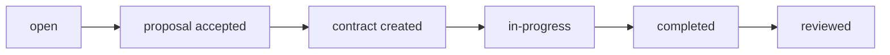

# Craftworks Backend API Documentation

## Logging & Monitoring
- All HTTP requests are logged using [morgan](https://www.npmjs.com/package/morgan) (dev format)
- Application events and errors are logged using [winston](https://www.npmjs.com/package/winston)
- Logs are written to:
  - `logs/combined.log` (all logs)
  - `logs/error.log` (errors only)
- All errors, warnings, and important events are timestamped and logged
- Console output is also formatted and timestamped

## Error Handling
- **404 Not Found**: Any request to a non-existent `/api/...` route returns `{ "message": "API route not found" }` with status 404
- **Invalid ObjectId**: If a route expects an ObjectId and you pass an invalid string, you get `{ "message": "Resource not found (invalid ID)" }` with status 404
- **Global Error Handler**: All unhandled errors return `{ "message": "Internal server error" }` with status 500 (unless a more specific status is set)
- All errors are logged with details about the request and error

## Contact Email
- `POST /api/send-emails` — Send a contact email from the website
  - **Request Body:**
    ```json
    {
      "name": "John Doe",
      "email": "john@example.com",
      "message": "Hello, I have a question."
    }
    ```
  - **Response:**
    ```json
    { "message": "Email sent successfully." }
    ```
  - **Error Response:**
    ```json
    { "message": "Name, email, and message are required." }
    ```
    or
    ```json
    { "message": "Failed to send email." }
    ```

## Authentication

- Register: `POST /api/auth/register`
  - **Example Request:**
    ```json
    {
      "full_name": "Jane Smith",
      "email": "jane@example.com",
      "phone": "1234567890",
      "password": "password123",
      "role": "client",
      "profile_image": ""
    }
    ```
  - **Example Response:**
    ```json
    {
      "token": "<JWT_TOKEN>",
      "user": {
        "id": "...",
        "full_name": "Jane Smith",
        "role": "client",
        "profile_image": ""
      }
    }
    ```
- Login: `POST /api/auth/login`
  - **Example Request:**
    ```json
    {
      "email": "jane@example.com",
      "password": "password123",
      "type": "clients" // or "admins"
    }
    ```
  - **Type field:**
    - `clients`: Only users with role `client` or `craftsman` can log in (for website/mobile app)
    - `admins`: Only users with role `admin` or `moderator` can log in (for dashboard)
    - If the role does not match the type, a 403 Forbidden error is returned.
  - **Example Response:**
    ```json
    {
      "token": "<JWT_TOKEN>",
      "user": {
        "id": "...",
        "full_name": "Jane Smith",
        "role": "client",
        "profile_image": ""
      }
    }
    ```
  - **Blocked User Response:**
    ```json
    {
      "message": "Account has been blocked",
      "blocked_at": "2024-01-15T10:30:00.000Z",
      "blocked_reason": "Violation of terms of service"
    }
    ```
- Forgot Password: `POST /api/auth/forgot-password`
  - **Example Request:**
    ```json
    { "email": "john@example.com" }
    ```
  - **Example Response:**
    ```json
    { "message": "Password reset email sent." }
    ```
  - *Note: The user will receive an email with a reset link valid for 15 minutes.*
- Reset Password: `POST /api/auth/reset-password`
  - **Example Request:**
    ```json
    { "token": "...", "password": "newpassword123" }
    ```
  - **Example Response:**
    ```json
    { "message": "Password has been reset" }
    ```
- All protected endpoints require a Bearer JWT token in the `Authorization` header.

## User Roles
- `admin`: Can manage users, jobs, services, reports, etc.
- `moderator`: Can moderate content and manage reports.
- `client`: Can post jobs, review craftsmen, message, etc.
- `craftsman`: Can submit proposals, manage profile, message, etc.

## User Ratings
- Every user (client or craftsman) has a `rating` (average, 1-5) and `rating_count` (number of received reviews) field on their user profile.
- Ratings are updated automatically whenever a review is created or updated.
- Both clients and craftsmen can review each other after a job is completed, but only after the contract is marked as completed and only once per contract.
- Example user object:
  ```json
  {
    "_id": "...",
    "role": "craftsman",
    "full_name": "Jane Smith",
    "email": "jane@example.com",
    "rating": 4.8,
    "rating_count": 12,
    ...
  }
  ```

## Pagination
- All paginated endpoints return:
  ```json
  {
    "data": [ ... ],
    "pagination": {
      "page": 1,
      "limit": 10,
      "totalPages": 5,
      "totalItems": 42
    }
  }
  ```

## HTTP Status Codes
- `200 OK`: Successful GET, PUT, DELETE
- `201 Created`: Successful POST
- `400 Bad Request`: Invalid input
- `401 Unauthorized`: Not logged in or invalid token
- `403 Forbidden`: Not allowed
- `404 Not Found`: Resource does not exist
- `500 Server Error`: Unexpected error

## Main Endpoints & Examples

### Users
- `GET /api/users/me` — Get your profile (any authenticated user)
- `GET /api/users/:id` — Get public user profile (email/phone only if self or admin/moderator)
- `PUT /api/users/me` — Update your profile
- `GET /api/users` — List all users (admin or moderator only)
- `DELETE /api/users/:id` — Delete user (admin or moderator only)

### Admin User Management
- `POST /api/admins/block-user` — Block a user (admin only)
  - **Example Request:**
    ```json
    {
      "user_id": "user_id_here",
      "reason": "Violation of terms of service"
    }
    ```
  - **Example Response:**
    ```json
    {
      "message": "User blocked successfully",
      "user": {
        "id": "...",
        "full_name": "Jane Smith",
        "email": "jane@example.com",
        "role": "client",
        "blocked": true,
        "blocked_at": "2024-01-15T10:30:00.000Z",
        "blocked_reason": "Violation of terms of service"
      }
    }
    ```
- `POST /api/admins/unblock-user` — Unblock a user (admin only)
  - **Example Request:**
    ```json
    {
      "user_id": "user_id_here"
    }
    ```
  - **Example Response:**
    ```json
    {
      "message": "User unblocked successfully",
      "user": {
        "id": "...",
        "full_name": "Jane Smith",
        "email": "jane@example.com",
        "role": "client",
        "blocked": false
      }
    }
    ```
- `GET /api/admins/blocked-users` — Get all blocked users (admin only)

### Jobs
- `POST /api/jobs` — Create job (client only)
- `GET /api/jobs` — List jobs (paginated, filterable)
- `GET /api/jobs/:id` — Get job details
- `PUT /api/jobs/:id` — Update job (owner, admin, or moderator)
- `DELETE /api/jobs/:id` — Delete job (owner, admin, or moderator)

### Proposals
- `POST /api/proposals` — Submit proposal (craftsman only)
- `GET /api/proposals` — List proposals (paginated, filterable)
- `GET /api/proposals/:id` — Get proposal (involved users, admin, or moderator)
- `PUT /api/proposals/:id` — Update status (job owner, admin, or moderator)
- `DELETE /api/proposals/:id` — Delete (craftsman, admin, or moderator)

### Contracts
- `POST /api/contracts` — Create contract (when proposal accepted)
- `GET /api/contracts` — List contracts (involved users, admin, or moderator)
- `GET /api/contracts/:id` — Get contract
- `PUT /api/contracts/:id` — Update (admin or moderator only)
- `DELETE /api/contracts/:id` — Delete (admin or moderator only)
- `POST /api/contracts/:id/complete` — Mark contract as completed (client or craftsman only)
  - **Effect:** Sets `status` to `completed`, sets `completed_at`, allows review.

### Reviews (Mutual)
- Both clients and craftsmen can review each other after a job is completed, but only once per contract.
- `POST /api/reviews` — Create review (involved users, only after contract is completed)
- `GET /api/reviews` — List reviews
- `GET /api/reviews/:id` — Get review
- `PUT /api/reviews/:id` — Update (author only)
- `DELETE /api/reviews/:id` — Delete (admin or moderator only)

### Messages
- `POST /api/messages` — Send message
- `GET /api/messages` — List messages (paginated, filterable)
- `GET /api/messages/:id` — Get message (sender/receiver, admin, or moderator)
- `DELETE /api/messages/:id` — Delete (sender, admin, or moderator)
- `PUT /api/messages/:id/read` — Mark message as read (receiver, admin, or moderator)

### Reports
- `POST /api/reports` — Create report (with `report_type`: `user`, `job`, or `message`)
- `GET /api/reports` — List reports (admin or moderator only)
- `GET /api/reports/:id` — Get report (involved users, admin, or moderator)
- `PUT /api/reports/:id/status` — Update report status (admin or moderator only)
- `DELETE /api/reports/:id` — Delete (admin or moderator only)

### Services (Categories)
- `POST /api/services` — Create (admin or moderator only)
  - **Example Request:**
    ```json
    {
      "name": "Plumbing",
      "icon": "faucet-icon",
      "description": "Water systems and pipe work",
      "subcategories": ["Repair", "Installation", "Maintenance"],
      "is_active": true
    }
    ```
- `GET /api/services` — List all
  - **Query Parameters:**
    - `active_only=true` — Only return active services
- `GET /api/services/:id` — Get service
- `PUT /api/services/:id` — Update (admin or moderator only)
- `DELETE /api/services/:id` — Delete (admin or moderator only)
- `GET /api/services/categories` — Get all available categories (public - no auth required)
  - **Use case:** Display categories on home page
  - **Example Response:**
    ```json
    [
      {
        "id": "...",
        "name": "Plumbing",
        "icon": "faucet-icon",
        "description": "Water systems and pipe work",
        "subcategories": ["Repair", "Installation", "Maintenance"]
      }
    ]
    ```
- `GET /api/services/categories/:category/craftsmen` — Get craftsmen by category (public - no auth required)
  - **Query Parameters:**
    - `page=1` — Page number
    - `limit=10` — Items per page
  - **Example Response:**
    ```json
    {
      "data": [
        {
          "_id": "...",
          "user_id": {
            "full_name": "John Doe",
            "email": "john@example.com",
            "profile_image": "...",
            "rating": 4.5,
            "rating_count": 12
          },
          "services": ["plumbing_id"],
          "bio": "Experienced plumber"
        }
      ],
      "pagination": {
        "page": 1,
        "limit": 10,
        "totalPages": 5,
        "totalItems": 42
      }
    }
    ```

### Craftsman Service Management
- `GET /api/services/craftsman/services` — Get your selected services (craftsman only)
  - **Example Response:**
    ```json
    {
      "services": [
        {
          "_id": "...",
          "name": "Plumbing",
          "icon": "faucet-icon",
          "description": "Water systems and pipe work",
          "subcategories": ["Repair", "Installation", "Maintenance"]
        }
      ]
    }
    ```
- `PUT /api/services/craftsman/services` — Update your services (craftsman only)
  - **Example Request:**
    ```json
    {
      "services": ["service_id_1", "service_id_2"]
    }
    ```
  - **Example Response:**
    ```json
    {
      "message": "Services updated successfully",
      "profile": {
        "id": "...",
        "user_id": "...",
        "services": ["service_id_1", "service_id_2"],
        "bio": "..."
      }
    }
    ```

### Profiles
- `POST /api/craftsman-profiles` — Create (craftsman only)
- `GET /api/craftsman-profiles` — List all
- `GET /api/craftsman-profiles/me` — Get own
- `PUT /api/craftsman-profiles/me` — Update own
- `DELETE /api/craftsman-profiles/:id` — Delete (admin or moderator only)
- `POST /api/client-profiles` — Create (client only)
- `GET /api/client-profiles` — List all
- `GET /api/client-profiles/me` — Get own
- `PUT /api/client-profiles/me` — Update own
- `DELETE /api/client-profiles/:id` — Delete (admin or moderator only)

## Activity Logging
- All important actions (user registration, admin actions, deletions, service changes, etc.) are logged in the ActivityLog collection.
- Each log entry includes: who did the action, what action, what target, details, and timestamp.
- **Admin-only endpoint:**
  - `GET /api/activity-logs` — List recent activity logs (admin only)
    - Query params: `limit` (default 100), `skip` (default 0)
    - Example response:
      ```json
      [
        {
          "_id": "...",
          "user": { "_id": "...", "full_name": "Admin User", "role": "admin" },
          "action": "create_admin",
          "target": "Admin",
          "targetId": "...",
          "details": { "user_id": "...", "role_type": "moderator" },
          "createdAt": "2024-06-01T12:00:00.000Z"
        }
      ]
      ```
- Moderators and other roles cannot access this endpoint.

## Resource Relationships
- **Jobs → Proposals → Contracts → Reviews**
- A job is posted by a client, craftsmen submit proposals, client accepts a proposal to create a contract, contract is completed, then both parties can review each other.

## Job Status Flow


## File Uploads
- Use `/api/services/uploads` as a placeholder for now. In production, integrate with S3, Cloudinary, or similar.

---
For more details, see the code or contact the maintainer. 