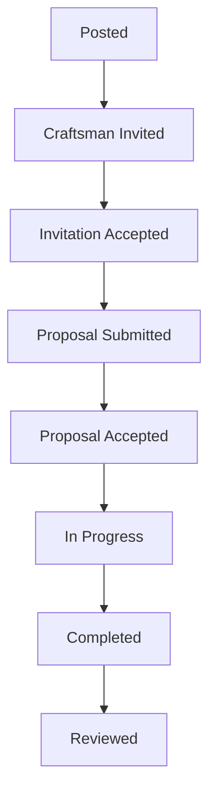

# Backend Requirements for Service Marketplace (Updated with Craftsman Invitations)

This document outlines the backend technical and functional requirements for the Egyptian local craftsmen service marketplace, including support for inviting craftsmen to jobs.

---

## Table of Contents

1. [Core Architecture & Technology Stack](#1-core-architecture--technology-stack)
2. [Key Functional Requirements](#2-key-functional-requirements)

   - [User & Job Management](#21-user--job-management)
   - [Payments, Wallet, and Fees](#22-payments-wallet-and-fees)
   - [Ratings, Disputes, & Cancellations](#23-ratings-disputes--cancellations)
   - [Notification System](#25-notification-system)
   - [AI Recommendations](#26-ai-recommendations)

3. [Admin & Operational Backend](#3-admin--operational-backend)
4. [Security & Non-Functional Requirements](#4-security--non-functional-requirements)
5. [Proposed API Endpoints](#5-proposed-api-endpoints)

   - [Authentication](#51-authentication-auth)
   - [Users](#52-users-users)
   - [Jobs](#53-jobs-jobs)
   - [Quotes](#54-quotes-jobsjobidquotes)
   - [Invitations](#55-invitations-jobid-invitations)
   - [Payments & Wallet](#56-payments--wallet-wallet)
   - [Reviews & Disputes](#57-reviews--disputes-reviews-disputes)
   - [Admin](#58-admin-admin)
   - [Contact Email](#59-contact-email-send-email)
   - [Services](#510-services-services)
   - [Notifications](#511-notifications)

6. [MongoDB Database Schemas (Mongoose-style)](#6-mongodb-database-schemas-mongoose-style)
7. [Implementation & Operational Details](#7-implementation--operational-details)

---

## 1. Core Architecture & Technology Stack

The backend infrastructure will be built on a modern, scalable stack to support real-time interactions and secure transactions.

- **Programming Language/Framework:** Node.js with the Express.js framework.
- **Database:** MongoDB Atlas (NoSQL Document Database).
- **Real-Time Communication:** WebSockets (e.g., using Socket.IO) for live job status tracking, chat, and notifications.
- **Authentication:**
  - **Primary:** Email/Password and Phone/Password authentication using JWTs (JSON Web Tokens), including a secure password reset flow.
  - **Secondary (Optional):** Social authentication providers.
- **File Storage:** Cloudinary for managing and serving profile pictures, job images, and verification documents.
- **Push Notifications:** Firebase Cloud Messaging (FCM) for sending critical alerts to both client and craftsman mobile apps.
- **System Monitoring & Logging:** Integration with Sentry for error tracking, LogRocket for session replay/debugging, and other standard uptime monitoring tools.

---

## 2. Key Functional Requirements

These are the core features that the backend must support to enable the end-to-end user journeys.

### 2.1. User & Job Management

- **User Roles:** System must support distinct roles: client, craftsman, admin, and moderator.
- **Craftsman Verification:** API endpoints for craftsmen to upload skill tags and certification documents. An admin-facing workflow to review and approve/reject craftsman profiles.
- **Job Lifecycle Management:**
  - Endpoints for clients to CREATE, READ, UPDATE, and DELETE job postings.
  - Functionality for craftsmen to browse available jobs and submit structured quotes.
  - A state machine for job status tracking (e.g., Posted, Quoted, Hired, On The Way, Completed, Disputed, Cancelled).

### 2.2. Payments, Wallet, and Fees

- **Payment Gateway Integration:** Deep integration with Stripe Connect and FawryPay.
- **Payment Flows:** Support for Escrow, Standard Cash, and Cash with Protected Payment.
- **Craftsman Wallet System:** A dedicated wallet for each craftsman with auto-deductions, top-up capability, and withdrawal processing.
- **Fee Remittance:** Automated system for tracking and reminding craftsmen to remit fees from cash jobs.

### 2.3. Ratings, Disputes, & Cancellations

- **Double-Blind Rating System:** Ratings are revealed only after both parties submit or after 14 days.
- **Dispute Resolution Workflow:** A system for users to raise disputes and for admins to manage them.
- **Cancellation Logic:** Rules for cancellation based on job status.

### 2.4. Craftsman Invitations

- **Craftsman Invitations**:

  - Clients can now invite specific craftsmen to posted jobs.
  - Craftsmen can accept or reject invitations.
  - Accepted craftsmen can submit quotes.

### 2.5. Notification System

- The system must notify users of important events (invitations, quotes, status changes, etc.) via in-app, push, and/or email.
- Notifications are stored in a `notifications` collection.
- Real-time delivery is supported via WebSocket (Socket.IO).
- Users can fetch and mark notifications as read via API.

#### Notification Events Table

| Event                        | Recipient    | Channel(s)          |
| ---------------------------- | ------------ | ------------------- |
| Craftsman invited to job     | Craftsman    | In-app, Push, Email |
| Craftsman applies/quotes     | Client       | In-app, Push, Email |
| Invitation accepted/rejected | Client       | In-app, Push, Email |
| Job status changes           | Both parties | In-app, Push, Email |

### 2.6. AI Recommendations

- The system provides AI-powered recommendations to clients for inviting craftsmen to jobs.
- Recommendations are based on job parameters, required skills, location proximity, craftsman ratings, past job performance, and availability.
- The recommendation engine may use machine learning, rule-based logic, or a hybrid approach.
- Clients can request recommendations when creating or managing a job.

---

## 3. Admin & Operational Backend

- **Admin Tooling:** Secure endpoints for all admin functions with Role-Based Access Control (RBAC), including Moderator role management.
- **CRM & Reporting:** Endpoints to fetch user history and generate data for BI dashboards.
- **AI & Automation:** Backend support for AI-powered job matching and an FAQ chatbot.

---

## 4. Security & Non-Functional Requirements

- **Data Security & Backups:**
  - Utilize MongoDB Atlas's built-in automated backup features.
  - Store backups in multi-region replicas.
  - Ensure a Recovery Time Objective (RTO) of less than 2 hours.
  - Securely encrypt and store sensitive craftsman KYC data.
- **Data Privacy:** Implement API endpoints and corresponding database logic for GDPR-inspired data deletion requests.
- **Performance SLAs:**
  - Push Notification Latency: < 5 seconds.
  - Payout Processing: < 2 business days.
  - Dispute Resolution: < 72 hours median time.

---

## 5. Proposed API Endpoints

All endpoints should be prefixed with `/api`.

### 5.1. Authentication (`/auth`)

- `POST /api/auth/register` - Creates a new user account (Client or Craftsman).
- `POST /api/auth/login` - Authenticates a user and returns a JWT token. The request body should include a loginIdentifier (which can be an email or a phone number for clients/craftsmen, and must be an email for Admins), a password, and a type (clients, admins).
- `POST /api/auth/logout` - Invalidates the user's current session/token.
- `POST /api/auth/forgot-password` - Sends a password reset token to the user's email.
- `POST /api/auth/reset-password` - Resets the user's password using a valid token.

### 5.2. Users (`/users`)

- `GET /api/users/me` - Get the profile of the currently authenticated user.
- `PUT /api/users/me` - Update the profile of the currently authenticated user.
- `GET /api/users/:userId` - Get the public profile of a specific user (client or craftsman).
- `POST /api/users/craftsman/verification` - (Craftsman only) Submit verification documents.
- `GET /api/users/recommendations?jobId=...` — Get a list of recommended craftsmen for a specific job, based on AI/matching logic. Only accessible to clients.

### 5.3. Jobs (`/jobs`)

- `POST /api/jobs` - (Client only) Create a new job posting.
- `GET /api/jobs` - Get a list of jobs (for craftsmen to browse, with filters).
- `GET /api/jobs/:jobId` - Get details of a specific job.
- `PUT /api/jobs/:jobId` - (Client only) Update a job posting.
- `DELETE /api/jobs/:jobId` - (Client only) Cancel a job posting.
- `PATCH /api/jobs/:jobId/status` - Update the status of a job (e.g., hire, start, complete).

### 5.4. Quotes (`/jobs/:jobId/quotes`)

- `POST /api/jobs/:jobId/quotes` - (Craftsman only) Submit a quote for a job.
- `GET /api/jobs/:jobId/quotes` - (Client only) Get all quotes for a job.
- `POST /api/jobs/:jobId/quotes/:quoteId/accept` - (Client only) Accept a quote and hire the craftsman.

### 5.5. Invitations (`/jobs/:jobId/invitations`)

**Invite a craftsman to a job**
`POST /api/jobs/:jobId/invite` (Client only)

```json
{
  "craftsmanId": "..."
}
```

**View invitations for a job**
`GET /api/jobs/:jobId/invitations` (Client only)

**Craftsman responds to invitation**
`POST /api/jobs/:jobId/invitations/respond` (Craftsman only)

```json
{
  "response": "Accepted" // or "Rejected"
}
```

### 5.6. Payments & Wallet (`/wallet`) (craftsman only)

- `GET /api/wallet/balance` - Get the current user's wallet balance.
- `GET /api/wallet/transactions` - Get a list of wallet transactions.
- `POST /api/wallet/withdraw` - Request a withdrawal from the wallet.
- `POST /api/payments/initiate` - Initiate a payment for a job (escrow).
- `POST /api/payments/webhook` - Webhook endpoint for Stripe/Fawry to send payment status updates.

### 5.7. Reviews & Disputes (`/reviews`, `/disputes`)

- `POST /api/reviews` - Submit a review for a completed job.
- `POST /api/disputes` - Create a new dispute for a job.
- `GET /api/disputes/:disputeId` - Get details of a dispute.
- `POST /api/disputes/:disputeId/evidence` - Add evidence (messages, photos) to a dispute.

### 5.8. Admin (`/admin`)

- `GET /api/admin/users` - Get a paginated list of all users for admin management. Supports `page` and `limit` query parameters. Returns paginated results in the standard format:
  ```json
  {
    "data": [ ... ],
    "pagination": {
      "page": 1,
      "limit": 10,
      "totalPages": 5,
      "totalItems": 42
    }
  }
  ```
  - This endpoint allows the admin to browse all users and perform actions such as ban, unban, or view user details.
- `POST /api/admin/users/create-admin` - Create a new user with the admin or moderator role.
- `PATCH /api/admin/users/:userId/ban` - Ban a user account.
- `PATCH /api/admin/users/:userId/unban` - Unban a user account.
- `GET /api/admin/verifications` - Get a list of pending craftsman verifications.
- `POST /api/admin/verifications/:verificationId/approve` - Approve a craftsman's verification.
- `POST /api/admin/verifications/:verificationId/reject` - Reject a craftsman's verification.
- `GET /api/admin/disputes` - Get a list of all active disputes.
- `POST /api/admin/disputes/:disputeId/resolve` - Resolve a dispute with a final decision.
- `DELETE /api/admin/jobs/:jobId` - Forcibly delete a job posting.

### 5.9. Contact Email (`/send-email`)

- `POST /api/send-email` - Send a contact email from the website. Allows users to reach out to support or the team using a form.
  - **Request Body Example:**
    ```json
    {
      "name": "John Doe",
      "email": "john@example.com",
      "message": "Hello, I have a question."
    }
    ```
  - **Response Example:**
    ```json
    { "message": "Email sent successfully." }
    ```
  - **Error Response Example:**
    ```json
    { "message": "Name, email, and message are required." }
    ```
    or
    ```json
    { "message": "Failed to send email." }
    ```

### 5.10. Services (`/services`)

- `GET /api/services` - Get a list of all available services. This endpoint is used by craftsmen to select their skills/services for their profile, and by clients when creating a job to choose the job category, or publicly to display our services.
  - **Example Response:**
    ```json
    [
      {
        "id": "...",
        "name": "Plumbing",
        "icon": "faucet-icon",
        "description": "Water systems and pipe work"
      }
    ]
    ```
- `POST /api/services` - Create a new service. **admin or moderator only.**
- `PUT /api/services/:id` - Update an existing service. **admin or moderator only.**
- `DELETE /api/services/:id` - Delete a service. **admin or moderator only.**

Only users with the Admin or Moderator role can create, update, or delete services. Craftsmen and clients can only retrieve services.

### 5.11. Notifications (`/notifications`)

- `GET /api/notifications` — List user notifications.
- `POST /api/notifications/mark-read` — Mark notifications as read.

### 5.12. AI Recommendations (`/users/recommendations`)

- `GET /api/users/recommendations?jobId=...` — Returns a ranked list of recommended craftsmen for the given job, considering skills, location, ratings, and other factors.

---

## 6. MongoDB Database Schemas (Mongoose-style)

This section details the proposed document structures for the main collections.

### 6.1. users Collection

```js
{
  _id: ObjectId,
  email: { type: String, unique: true, required: true, lowercase: true },
  password: { type: String, required: true }, // Will be stored as a hash
  phone: { type: String, unique: true, sparse: true }, // Optional, but unique if provided
  role: { type: String, enum: ['Client', 'Craftsman', 'Admin', 'Moderator'], required: true },
  firstName: String,
  lastName: String,
  profilePicture : String, // Cloudinary URL
  location: { // GeoJSON for location-based searches
    type: { type: String, enum: ['Point'], default: 'Point' },
    coordinates: { type: [Number], index: '2dsphere' } // [longitude, latitude]
  },
  // Craftsman-specific fields
  craftsmanInfo: {
    skills: [String], // e.g., ['Plumbing', 'Electrical']
    bio: String,
    portfolioImageUrls: [String], // Cloudinary URLs
    verificationStatus: { type: String, enum: ['Pending', 'Verified', 'Rejected'], default: 'Pending' },
    verificationDocs: [{
      docType: String, // e.g., 'National ID', 'Certificate'
      docUrl: String // Cloudinary URL
    }]
  },
  // Wallet
  wallet: {
    balance: { type: Number, default: 0 }, // In smallest currency unit (e.g., piastres)
    withdrawableBalance: { type: Number, default: 0 }
  },
  // Account Status
  isBanned: { type: Boolean, default: false },
  // Password Reset
  resetPasswordToken: String,
  resetPasswordExpires: Date,
  createdAt: { type: Date, default: Date.now },
  updatedAt: { type: Date, default: Date.now }
}
```

### 6.2. jobs Collection

```js
{
  _id: ObjectId,
  client: { type: ObjectId, ref: 'User', required: true },
  craftsman: { type: ObjectId, ref: 'User', default: null }, // Assigned after quote acceptance
  title: { type: String, required: true },
  description: { type: String, required: true },
  category: { type: String, required: true }, // e.g., 'Plumbing'
  photos: [String], // Cloudinary URLs
  address: String,
  location: { // GeoJSON
    type: { type: String, enum: ['Point'], default: 'Point' },
    coordinates: [Number]
  },
  status: {
    type: String,
    enum: ['Posted', 'Quoted', 'Hired', 'On The Way', 'Completed', 'Disputed', 'Cancelled'],
    default: 'Posted'
  },
  paymentType: { type: String, enum: ['Escrow', 'Cash', 'CashProtected'] },
  jobPrice: { type: Number, default: 0 }, // Final price from accepted quote
  platformFee: { type: Number, default: 0 },
  createdAt: { type: Date, default: Date.now },
  hiredAt: Date,
  completedAt: Date
}
```

### 6.3. quotes Collection

```js
{
  _id: ObjectId,
  job: { type: ObjectId, ref: 'Job', required: true },
  craftsman: { type: ObjectId, ref: 'User', required: true },
  price: { type: Number, required: true },
  notes: String,
  status: { type: String, enum: ['Submitted', 'Accepted', 'Declined'], default: 'Submitted' },
  createdAt: { type: Date, default: Date.now }
}
```

### 6.4. reviews Collection

```js
{
  _id: ObjectId,
  job: { type: ObjectId, ref: 'Job', required: true },
  reviewer: { type: ObjectId, ref: 'User', required: true }, // The one writing the review
  reviewee: { type: ObjectId, ref: 'User', required: true }, // The one being reviewed
  rating: { type: Number, min: 1, max: 5, required: true },
  comment: String,
  isReviewerSideSubmitted: { type: Boolean, default: false }, // Part of double-blind logic
  isRevieweeSideSubmitted: { type: Boolean, default: false },
  createdAt: { type: Date, default: Date.now }
}
```

### 6.5. transactions Collection

```js
{
  _id: ObjectId,
  user: { type: ObjectId, ref: 'User', required: true }, // User whose wallet is affected
  job: { type: ObjectId, ref: 'Job' }, // Optional, linked to a job
  type: { type: String, enum: ['Deposit', 'Withdrawal', 'Payout', 'Fee', 'Refund'], required: true },
  amount: { type: Number, required: true }, // Can be negative for debits
  status: { type: String, enum: ['Pending', 'Completed', 'Failed'], default: 'Pending' },
  gateway: { type: String, enum: ['Stripe', 'Fawry', 'System'] }, // System for internal transfers
  gatewayTransactionId: String,
  createdAt: { type: Date, default: Date.now }
}
```

### 6.6. invitations Collection (New)

```js
{
  _id: ObjectId,
  job: { type: ObjectId, ref: 'Job', required: true },
  craftsman: { type: ObjectId, ref: 'User', required: true },
  status: { type: String, enum: ['Pending', 'Accepted', 'Rejected'], default: 'Pending' },
  respondedAt: Date,
  createdAt: { type: Date, default: Date.now }
}
```

### 6.7. notifications Collection (New)

```js
{
  _id: ObjectId,
  user: { type: ObjectId, ref: 'User', required: true }, // recipient
  type: { type: String, enum: ['invitation', 'quote', 'status', 'review', 'dispute', 'admin', ...], required: true },
  title: String,
  message: String,
  data: Object, // extra payload (e.g., jobId, invitationId)
  read: { type: Boolean, default: false },
  createdAt: { type: Date, default: Date.now }
}
```

---

## 7. Implementation & Operational Details

### 7.1. Environment Variables

The following environment variables are required for the backend to function:

```env
# Database
MONGODB_URI=mongodb://localhost:27017/craftworks
# JWT
JWT_SECRET=your_jwt_secret_here
# Email (Resend)
RESEND_API_KEY=your_resend_api_key_here
# Cloudinary (for image uploads)
CLOUDINARY_CLOUD_NAME=your_cloud_name
CLOUDINARY_API_KEY=your_api_key
CLOUDINARY_API_SECRET=your_api_secret
```

### 7.2. Image Upload (Cloudinary)

- Profile images are uploaded to Cloudinary and stored in the `profile-images` folder.
- Images are automatically resized to 400x400 pixels and optimized.
- Old profile images are automatically deleted when a new one is uploaded.
- Supported formats: JPG, PNG, GIF, WebP.
- Maximum file size: 5MB.
- Temporary files are automatically cleaned up after upload.

### 7.3. Logging & Monitoring

- All HTTP requests are logged (e.g., using morgan).
- Application events and errors are logged (e.g., using winston).
- Logs are written to:
  - `logs/combined.log` (all logs)
  - `logs/error.log` (errors only)
- All errors, warnings, and important events are timestamped and logged.
- Console output is also formatted and timestamped.

### 7.4. Error Handling

- **404 Not Found:** Any request to a non-existent `/api/...` route returns `{ "message": "API route not found" }` with status 404.
- **Invalid ObjectId:** If a route expects an ObjectId and you pass an invalid string, you get `{ "message": "Resource not found (invalid ID)" }` with status 404.
- **Global Error Handler:** All unhandled errors return `{ "message": "Internal server error" }` with status 500 (unless a more specific status is set).
- All errors are logged with details about the request and error.

### 7.5. Authentication & Authorization (Updated)

- All protected endpoints require a Bearer JWT token in the `Authorization` header.
- The `type` field in login determines which roles can log in:
  - `clients`: Only users with role `client` or `craftsman` can log in (for website/mobile app).
  - `admins`: Only users with role `admin` or `moderator` can log in (for dashboard).
  - If the role does not match the type, a 403 Forbidden error is returned.
- Blocked users receive a specific error response with block reason and timestamp.
- Only **clients** can invite craftsmen to jobs they own.
- Only **craftsmen** can respond to invitations.
- Role-based access enforced with 403 Forbidden errors.

### 7.6. User Roles & Permissions

- **admin:** Can manage users, jobs, services, reports, etc.
- **moderator:** Can moderate content and manage reports, but cannot access admin-only endpoints like activity logs.
- **client:** Can post jobs, review craftsmen, message, etc.
- **craftsman:** Can submit proposals, manage profile, message, etc.

### 7.7. User Ratings

- Every user (client or craftsman) has a `rating` (average, 1-5) and `ratingCount` (number of received reviews) field on their user profile.
- Ratings are updated automatically whenever a review is created or updated.
- Both clients and craftsmen can review each other after a job is completed, but only after the contract is marked as completed and only once per contract.

### 7.8. Pagination

- All paginated endpoints return:
  ```json
  {
    "data": [ ... ],
    "pagination": {
      "page": 1,
      "limit": 10,
      "totalPages": 5,
      "totalItems": 42
    }
  }
  ```

### 7.9. HTTP Status Codes

- `200 OK`: Successful GET, PUT, DELETE
- `201 Created`: Successful POST
- `400 Bad Request`: Invalid input
- `401 Unauthorized`: Not logged in or invalid token
- `403 Forbidden`: Not allowed
- `404 Not Found`: Resource does not exist
- `500 Server Error`: Unexpected error

### 7.10. Business Logic (Updated)

- For user update endpoints, support profile image upload, optional fields, and validation.
- For password change, require current and new password, validate length, and return appropriate error messages.
- For job, proposal, contract, review, and message flows, clarify who can access or modify what, and under what conditions (e.g., only job owner, admin, or moderator can update/delete jobs).
- A craftsman cannot be invited more than once to the same job.
- Accepted invitations allow direct quote submission.
- Clients cannot re-invite rejected craftsmen unless job is recreated.
- Only active jobs (status = `Posted`) can have invitations sent.

### 7.11. Activity Logging

- All important actions (user registration, admin actions, deletions, service changes, etc.) are logged in the ActivityLog collection.
- Each log entry includes: who did the action, what action, what target, details, and timestamp.
- Only admins can access the activity log endpoint.

### 7.12. Resource Relationships

- **Jobs → Proposals → Contracts → Reviews**
- A job is posted by a client, craftsmen submit proposals, client accepts a proposal to create a contract, contract is completed, then both parties can review each other.

### 7.13. Job Status Flow (Updated)



### 7.14. File Uploads

- Use `/api/services/uploads` as a placeholder for now. In production, integrate with S3, Cloudinary, or similar.

---
